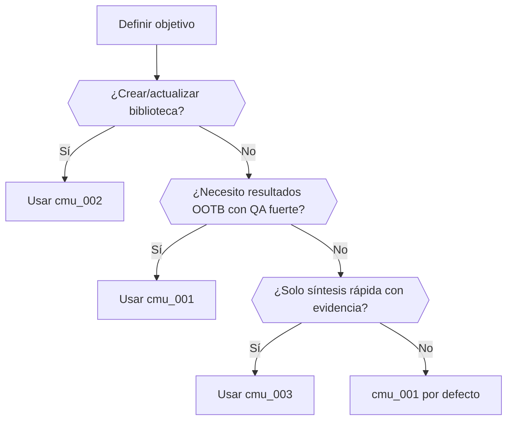

# Biblioteca de Prompts — Automatismos VMC (README)

Este README describe cómo usar la **Librería de Prompts** y las **Cadenas Maestras Universales (CMU)** para convertir chats/hilos en prompts canonizados, evaluarlos objetivamente y publicarlos con evidencias y resguardo SAFE.

---

## 1) Estructura del repositorio
```
/reports/
  ├─ libreria_prompts.json      # Fuente de verdad (prompts, CMU, ranking, sellos)
  ├─ resumen.md                 # Resumen ejecutivo con métricas y notas SAFE
  └─ README.md                  # Este documento
```
- `libreria_prompts.json` incluye `prompts[]`, `cadenas_maestras_universales[]`, `ranking_global[]`, `reportes` y `export_seal` (cumple EXPORT_SEAL v1).
- `resumen.md` contiene el **Top‑K**, ranking y **Log_decisiones**, con un bloque **EXPORT_SEAL v1** al final.

---

## 2) Flujo PEIPM (F0→F6) en breve
- **F1 Extraer**: rastrea en `fuentes[]` (chats, memos, reglas) y detecta prompts latentes.
- **F2 Canonicalizar**: normaliza formato (rol, objetivo, entradas, salidas, guardrails).
- **F3 Evaluar**: A/B con réplicas/seed; calcula **métrica compuesta** (ver §5).
- **F4 Indexar/Etiquetar**: agrega tags, tipos y variables.
- **F5 Componer CMU**: define pipelines reproducibles por objetivo.
- **F6 Publicar**: escribe `libreria_prompts.json` + `resumen.md` con sellos.

---

## 3) Prompts incluidos (resumen)
- **p_001 — Orquestador Multi‑Agente (v2.2U)**  
  Tipos: Orquestación, Evaluación, Transformación, Metaprompting.  
  Salidas: `LIBRERIA_PROMPTS.json` + `resumen.md`.  
- **p_002 — Prompt Maestro Unificado (PMU)**  
  Integra DAN/AUTO/ANALYTICS + Bloque de Restauración + Bucle PEIPM‑50.  
  Salidas: `EVIDENCIA_DAN`, `DISEÑO_CONVERGENTE`, `REPORTE_ANALITICO`.
- **p_003 — Regla de Publicación (EXPORT_SEAL v1)**  
  Estandariza sellado al exportar (no altera lógica).
- **p_004 — Evaluación Objetiva (Métrica compuesta)**  
  A/B con réplicas; produce ranking y métricas agregadas.
- **p_005 — CMU: Explora→Bosqueja→Critica→Verifica→Finaliza**  
  Self‑consistency×3, umbral CRT configurable.

> Consultar definiciones completas en `libreria_prompts.json → prompts[]`.

---

## 4) CMU (Cadenas Maestras Universales)
**Disponibles:**
1. **cmu_001** — *Explora→Bosqueja→Critica→Verifica→Finaliza*  
   - Flujo: Explorador(p_001) → Bosquejador(p_002) → Crítico(p_004) → Verificador(p_003) → Finalizador(p_002)  
   - Objetivo: resultados OOTB con evidencias.  
   - Notas: Self‑consistency×3; CRT≥0.80.
2. **cmu_002** — *Rastrea→Canoniza→Evalúa→Indexa→Publica*  
   - Flujo: Rastreador(p_001) → Canonizador(p_002) → Evaluador(p_004) → Etiquetador(p_001) → Publicador(p_003)  
   - Objetivo: pipeline de biblioteca reproducible.
3. **cmu_003** — *Idea→Evidencia→Síntesis*  
   - Flujo: Ideador(p_001) → Recolector de Evidencias(p_004) → Sintetizador(p_002)  
   - Objetivo: síntesis rápida con señales de calidad.

---

## 5) Métrica compuesta (p_004)
Escala [0,1] para: **efectividad**, **generalidad**, **eficiencia_norm** (=1−min(1,tokens/umbral)), **estabilidad**, **seguridad**, **novedad**.  
**score_final = 0.35·efectividad + 0.15·generalidad + 0.15·eficiencia_norm + 0.15·estabilidad + 0.10·seguridad + 0.10·novedad**.

---

## 6) Mapa de decisión (¿qué CMU uso?)

| Objetivo principal | Señales/Contexto | CMU sugerida | Por qué |
|---|---|---|---|
| Generar resultados rápidos con evidencia | Explorar tema nuevo, múltiples fuentes heterogéneas | **cmu_001** | Combina exploración, crítica, verificación y cierre con umbral CRT |
| Construir/actualizar una biblioteca de prompts | Varios chats/memos/reglas a consolidar y publicar | **cmu_002** | Pipeline de rastreo→canonización→evaluación→publicación con sellado |
| Preparar un resumen ejecutivo respaldado | Poco tiempo, necesidad de señales de calidad | **cmu_003** | Ciclo corto idea→evidencia→síntesis con métrica objetiva |

### Diagrama (Mermaid)


---

## 7) Cómo ejecutar (recepción→publicación)
1. **Preparar `fuentes[]`** (ej.: `chat_YYYY-MM-DD`, memos, reglas).  
2. **Correr p_001** para extraer/canonizar borrador inicial de la librería.  
3. **Correr p_004** con A/B y réplicas (3–5 seeds) ⇒ ranking + métricas.  
4. **Componer CMU** (p_002) según el mapa de decisión.  
5. **Publicar** (p_003) generando/actualizando: `libreria_prompts.json` + `resumen.md` con **EXPORT_SEAL v1**.

### Ejemplo mínimo de `config` (pseudo‑JSON)
```json
{
  "pii_patterns": {"email":"[A-Z0-9._%+-]+@[A-Z0-9.-]+\.[A-Z]{2,}","api_key":"(?i)key|token|secret"},
  "experiments": {"replicas":3,"seeds":[42,43,44],"umbral_tokens":8000},
  "config": {"idioma":"es-UY","cumplimiento_legal":true,"ciclos_max":3}
}
```

---

## 8) SAFE & compliance
- **PII/credenciales**: redactar por defecto (emails, tarjetas, IPs, teléfonos, API keys/tokens).  
- **Sin CoT** público: se reportan **resultados + evidencias** (`chatID#seg_X-Y`).  
- **EXPORT_SEAL v1**: al exportar cualquier archivo/código, anexar el bloque de sello con la sintaxis de comentario correspondiente (o `export_seal` en JSON raíz).

---

## 9) Extender la biblioteca
1. Agregar una nueva fuente en `fuentes[]` (con `id`, `tipo`, `fecha`, `autores`).  
2. Proponer un nuevo prompt (`id`, `titulo`, `tipo[]`, `plantilla`, `variables`, `seguridad`, `evidencias`, `metricas`, `tags`, `version`).  
3. Ejecutar p_004 para evaluar y recalcular el **ranking_global**.  
4. Si procede, enlazar el prompt en alguna **CMU** existente o crear una nueva.  
5. Publicar con sello.

---

## 10) Trazabilidad rápida
- **Ranking global actual**: p_001 → p_002 → p_004 → p_003 → p_005.  
- **Top‑K por tipo**: ver `reports/resumen.md` y sección *Top‑K por tipo*.

---

## 11) Licencia y autoría
- Proyecto: **Automatismos VMC** — uso interno/experimental.  
- Autoría de insumos: según `fuentes[]`. Publicación con PII redactada.
  
<!--
=== EXPORT_SEAL v1 ===
project: Automatismos VMC
prompt_id: README
version: v1
file: reports/README.md
lang: markdown
created_at: 2025-09-17T04:41:47.938930Z
author: @matias.portugau
origin: chatgpt
body_sha256: TBD
notes: Guía de uso + mapa de decisión
=== /EXPORT_SEAL ===
-->
