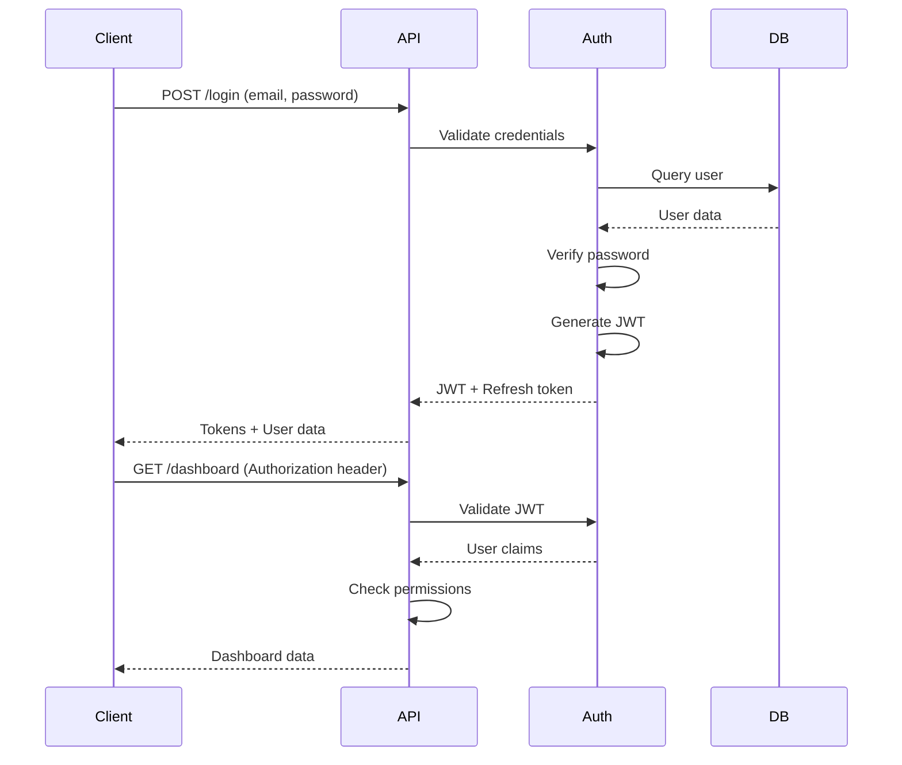

# Arquitectura del Sistema - Dashboard BMC

## 🏗️ Vista General de la Arquitectura

### Arquitectura de Alto Nivel
```
┌─────────────────────────────────────────────────────────────┐
│                    FRONTEND LAYER                           │
│  ┌─────────────┐ ┌─────────────┐ ┌─────────────────────────┐ │
│  │   React     │ │   Mobile    │ │      Admin Panel        │ │
│  │ Dashboard   │ │    App      │ │                         │ │
│  └─────────────┘ └─────────────┘ └─────────────────────────┘ │
└─────────────────────────────────────────────────────────────┘
                                 │
                        ┌────────▼────────┐
                        │   Load Balancer │
                        │    (Nginx)      │
                        └────────┬────────┘
                                 │
┌─────────────────────────────────▼──────────────────────────────┐
│                      API GATEWAY                               │
│  ┌─────────────┐ ┌─────────────┐ ┌─────────────────────────────┐ │
│  │  Auth API   │ │  Data API   │ │      Reports API            │ │
│  │             │ │             │ │                             │ │
│  └─────────────┘ └─────────────┘ └─────────────────────────────┘ │
└─────────────────────────────────────────────────────────────────┘
                                 │
┌─────────────────────────────────▼──────────────────────────────┐
│                    BUSINESS LOGIC LAYER                        │
│  ┌─────────────┐ ┌─────────────┐ ┌─────────────────────────────┐ │
│  │   Auth      │ │   Financial │ │      Analytics              │ │
│  │  Service    │ │   Service   │ │      Service                │ │
│  └─────────────┘ └─────────────┘ └─────────────────────────────┘ │
└─────────────────────────────────────────────────────────────────┘
                                 │
┌─────────────────────────────────▼──────────────────────────────┐
│                      DATA LAYER                                │
│  ┌─────────────┐ ┌─────────────┐ ┌─────────────────────────────┐ │
│  │ PostgreSQL  │ │    Redis    │ │       File Storage          │ │
│  │  (Primary)  │ │   (Cache)   │ │       (Reports)             │ │
│  └─────────────┘ └─────────────┘ └─────────────────────────────┘ │
└─────────────────────────────────────────────────────────────────┘
```

## 🎯 Principios Arquitectónicos

### 1. Separación de Responsabilidades
```javascript
const ArchitecturalPrinciples = {
  "Presentation_Layer": {
    responsibility: "UI/UX, User interactions",
    technologies: ["React", "TypeScript", "Tailwind"],
    patterns: ["Component-based", "State management", "Responsive design"]
  },
  
  "API_Layer": {
    responsibility: "Request handling, validation, routing",
    technologies: ["Express.js", "TypeScript", "OpenAPI"],
    patterns: ["RESTful APIs", "GraphQL", "API versioning"]
  },
  
  "Business_Logic": {
    responsibility: "Core business rules, calculations",
    technologies: ["Node.js", "TypeScript", "Domain models"],
    patterns: ["Domain-driven design", "Service layer", "Event-driven"]
  },
  
  "Data_Layer": {
    responsibility: "Data persistence, caching, storage",
    technologies: ["PostgreSQL", "Redis", "Prisma"],
    patterns: ["Repository pattern", "Unit of work", "CQRS"]
  }
}
```

### 2. Escalabilidad y Performance
```javascript
const ScalabilityStrategy = {
  "Horizontal_Scaling": {
    frontend: "CDN + Multiple deployments",
    api: "Load balancer + Multiple instances", 
    database: "Read replicas + Sharding"
  },
  
  "Vertical_Scaling": {
    optimization: "Resource allocation per service",
    monitoring: "Auto-scaling based on metrics",
    limits: "Defined resource boundaries"
  },
  
  "Caching_Strategy": {
    levels: ["Browser", "CDN", "Application", "Database"],
    policies: ["TTL-based", "Event-based invalidation"],
    tools: ["Redis", "CDN", "Service Worker"]
  }
}
```

## 🔧 Componentes del Sistema

### Frontend Architecture
```typescript
// Component Architecture
interface ComponentArchitecture {
  pages: {
    Dashboard: "Main dashboard page";
    Analytics: "Advanced analytics page";
    Reports: "Reports management";
    Settings: "User preferences";
  };
  
  components: {
    charts: "Reusable chart components";
    widgets: "KPI widgets";
    layout: "Layout components";
    common: "Shared UI components";
  };
  
  services: {
    api: "API communication";
    auth: "Authentication handling";
    cache: "Client-side caching";
    utils: "Utility functions";
  };
  
  state: {
    global: "Redux store for global state";
    local: "Component local state";
    cache: "Query cache with React Query";
  };
}
```

### Backend Architecture
```typescript
// Service Architecture
interface ServiceArchitecture {
  controllers: {
    AuthController: "Authentication endpoints";
    DashboardController: "Dashboard data endpoints";
    ReportsController: "Report generation endpoints";
    AdminController: "Administrative endpoints";
  };
  
  services: {
    AuthService: "Authentication business logic";
    FinancialService: "Financial calculations";
    ReportService: "Report generation logic";
    NotificationService: "Notification handling";
  };
  
  repositories: {
    UserRepository: "User data access";
    FinancialDataRepository: "Financial data access";
    AuditRepository: "Audit trail access";
  };
  
  middleware: {
    authentication: "JWT validation";
    authorization: "Role-based access";
    logging: "Request/response logging";
    rateLimit: "API rate limiting";
  };
}
```

## 🗃️ Modelo de Datos

### Base de Datos Principal (PostgreSQL)
```sql
-- Users and Authentication
CREATE TABLE users (
  id UUID PRIMARY KEY DEFAULT gen_random_uuid(),
  email VARCHAR(255) UNIQUE NOT NULL,
  password_hash VARCHAR(255) NOT NULL,
  first_name VARCHAR(100) NOT NULL,
  last_name VARCHAR(100) NOT NULL,
  role VARCHAR(50) NOT NULL DEFAULT 'viewer',
  is_active BOOLEAN DEFAULT true,
  last_login TIMESTAMP,
  created_at TIMESTAMP DEFAULT NOW(),
  updated_at TIMESTAMP DEFAULT NOW()
);

-- Financial Data
CREATE TABLE financial_data (
  id UUID PRIMARY KEY DEFAULT gen_random_uuid(),
  date DATE NOT NULL,
  type VARCHAR(50) NOT NULL, -- 'revenue', 'expense', 'profit', etc.
  category VARCHAR(100),
  amount DECIMAL(15,2) NOT NULL,
  currency VARCHAR(3) DEFAULT 'USD',
  description TEXT,
  source VARCHAR(100),
  created_by UUID REFERENCES users(id),
  created_at TIMESTAMP DEFAULT NOW(),
  updated_at TIMESTAMP DEFAULT NOW()
);

-- KPI Definitions
CREATE TABLE kpi_definitions (
  id UUID PRIMARY KEY DEFAULT gen_random_uuid(),
  name VARCHAR(100) NOT NULL,
  description TEXT,
  formula TEXT NOT NULL,
  unit VARCHAR(20),
  target_value DECIMAL(15,4),
  threshold_warning DECIMAL(15,4),
  threshold_critical DECIMAL(15,4),
  calculation_frequency VARCHAR(20) DEFAULT 'daily',
  is_active BOOLEAN DEFAULT true,
  created_at TIMESTAMP DEFAULT NOW()
);

-- KPI Values (Calculated)
CREATE TABLE kpi_values (
  id UUID PRIMARY KEY DEFAULT gen_random_uuid(),
  kpi_id UUID REFERENCES kpi_definitions(id),
  date DATE NOT NULL,
  value DECIMAL(15,4) NOT NULL,
  compared_to_previous DECIMAL(15,4),
  compared_to_target DECIMAL(15,4),
  status VARCHAR(20) DEFAULT 'normal', -- 'normal', 'warning', 'critical'
  calculated_at TIMESTAMP DEFAULT NOW(),
  UNIQUE(kpi_id, date)
);

-- User Dashboards Configuration
CREATE TABLE user_dashboards (
  id UUID PRIMARY KEY DEFAULT gen_random_uuid(),
  user_id UUID REFERENCES users(id),
  name VARCHAR(100) NOT NULL,
  configuration JSONB NOT NULL, -- Widget layout and settings
  is_default BOOLEAN DEFAULT false,
  created_at TIMESTAMP DEFAULT NOW(),
  updated_at TIMESTAMP DEFAULT NOW()
);

-- Audit Trail
CREATE TABLE audit_log (
  id UUID PRIMARY KEY DEFAULT gen_random_uuid(),
  user_id UUID REFERENCES users(id),
  action VARCHAR(100) NOT NULL,
  resource_type VARCHAR(100),
  resource_id VARCHAR(255),
  old_values JSONB,
  new_values JSONB,
  ip_address INET,
  user_agent TEXT,
  created_at TIMESTAMP DEFAULT NOW()
);
```

### Índices de Performance
```sql
-- Performance Indexes
CREATE INDEX idx_financial_data_date_type ON financial_data(date DESC, type);
CREATE INDEX idx_kpi_values_date_kpi ON kpi_values(date DESC, kpi_id);
CREATE INDEX idx_audit_log_user_date ON audit_log(user_id, created_at DESC);
CREATE INDEX idx_users_email_active ON users(email, is_active);

-- Partitioning for large tables
CREATE TABLE financial_data_y2025m01 PARTITION OF financial_data
  FOR VALUES FROM ('2025-01-01') TO ('2025-02-01');
```

### Cache Strategy (Redis)
```javascript
const CacheArchitecture = {
  // Session Management
  "session:${sessionId}": {
    ttl: "24 hours",
    data: "user session data"
  },
  
  // KPI Cache
  "kpi:${kpiId}:${date}": {
    ttl: "1 hour",
    data: "calculated KPI values"
  },
  
  // Dashboard Cache
  "dashboard:${userId}:${dashboardId}": {
    ttl: "15 minutes", 
    data: "dashboard configuration and data"
  },
  
  // Report Cache
  "report:${reportId}:${hash}": {
    ttl: "4 hours",
    data: "generated report content"
  }
}
```

## 🔌 APIs y Integraciones

### API Design Patterns
```typescript
// RESTful API Structure
interface APIStructure {
  "/api/v1/auth": {
    "POST /login": "User authentication";
    "POST /logout": "User logout";
    "POST /refresh": "Token refresh";
    "GET /me": "Current user info";
  };
  
  "/api/v1/dashboard": {
    "GET /summary": "Dashboard summary data";
    "GET /kpis": "All KPIs with current values";
    "POST /kpis/calculate": "Trigger KPI recalculation";
    "GET /charts/:chartId": "Chart data";
  };
  
  "/api/v1/reports": {
    "GET /": "List available reports";
    "POST /generate": "Generate new report";
    "GET /:reportId": "Get report by ID";
    "DELETE /:reportId": "Delete report";
  };
  
  "/api/v1/admin": {
    "GET /users": "List users (admin only)";
    "POST /users": "Create user";
    "PUT /users/:id": "Update user";
    "GET /audit": "Audit trail";
  };
}
```

### GraphQL Schema (Optional)
```graphql
type User {
  id: ID!
  email: String!
  firstName: String!
  lastName: String!
  role: Role!
  dashboards: [Dashboard!]!
  createdAt: DateTime!
}

type KPI {
  id: ID!
  name: String!
  description: String
  currentValue: Float!
  targetValue: Float
  status: KPIStatus!
  trend: Trend!
  history: [KPIValue!]!
}

type Dashboard {
  id: ID!
  name: String!
  widgets: [Widget!]!
  owner: User!
  isDefault: Boolean!
}

type Query {
  me: User
  dashboards: [Dashboard!]!
  kpis: [KPI!]!
  reports: [Report!]!
}

type Mutation {
  createDashboard(input: CreateDashboardInput!): Dashboard!
  updateWidget(id: ID!, input: UpdateWidgetInput!): Widget!
  generateReport(input: GenerateReportInput!): Report!
}
```

## 🔐 Seguridad Architecture

### Authentication Flow


### Authorization Matrix
```javascript
const AuthorizationMatrix = {
  roles: {
    viewer: {
      permissions: [
        "read:dashboard",
        "read:kpis", 
        "read:own_reports"
      ]
    },
    
    analyst: {
      permissions: [
        "read:dashboard",
        "read:kpis",
        "read:reports",
        "create:reports",
        "export:data"
      ]
    },
    
    manager: {
      permissions: [
        "read:*",
        "create:reports",
        "create:dashboards",
        "manage:team_users"
      ]
    },
    
    admin: {
      permissions: ["*"]
    }
  }
}
```

## 📊 Monitoreo y Observabilidad

### Application Performance Monitoring
```javascript
const MonitoringArchitecture = {
  metrics: {
    application: "Custom business metrics",
    infrastructure: "System resource metrics", 
    user: "User experience metrics"
  },
  
  logging: {
    levels: ["ERROR", "WARN", "INFO", "DEBUG"],
    format: "Structured JSON logging",
    aggregation: "Centralized log management"
  },
  
  tracing: {
    distributed: "Request tracing across services",
    performance: "Database query tracing",
    errors: "Error tracking and alerting"
  }
}
```

### Health Check Architecture
```typescript
interface HealthCheck {
  "/health": {
    status: "healthy" | "degraded" | "unhealthy";
    checks: {
      database: HealthStatus;
      redis: HealthStatus;
      external_apis: HealthStatus;
    };
    timestamp: string;
    version: string;
  };
}
```

## 🚀 Deployment Architecture

### Container Strategy
```dockerfile
# Multi-stage Docker build
FROM node:18-alpine AS builder
WORKDIR /app
COPY package*.json ./
RUN npm ci --only=production

FROM node:18-alpine AS runtime
WORKDIR /app
COPY --from=builder /app/node_modules ./node_modules
COPY . .
EXPOSE 3000
CMD ["npm", "start"]
```

### Kubernetes Deployment
```yaml
apiVersion: apps/v1
kind: Deployment
metadata:
  name: dashboard-bmc-api
spec:
  replicas: 3
  selector:
    matchLabels:
      app: dashboard-bmc-api
  template:
    metadata:
      labels:
        app: dashboard-bmc-api
    spec:
      containers:
      - name: api
        image: dashboard-bmc:latest
        ports:
        - containerPort: 3000
        env:
        - name: DATABASE_URL
          valueFrom:
            secretKeyRef:
              name: db-credentials
              key: url
        resources:
          requests:
            memory: "256Mi"
            cpu: "250m"
          limits:
            memory: "512Mi" 
            cpu: "500m"
```

## 📈 Escalabilidad y Performance

### Caching Strategy
```javascript
const CachingLayers = {
  "L1_Browser": {
    type: "Browser cache",
    duration: "1 hour for static, 5 min for data",
    invalidation: "Version-based"
  },
  
  "L2_CDN": {
    type: "Content Delivery Network",
    duration: "24 hours for assets, 1 hour for API",
    invalidation: "Manual + automated"
  },
  
  "L3_Application": {
    type: "Redis cache",
    duration: "15 min - 4 hours based on data type",
    invalidation: "Event-driven"
  },
  
  "L4_Database": {
    type: "Query result cache",
    duration: "Query-specific",
    invalidation: "Data change events"
  }
}
```

### Load Balancing Strategy
```nginx
upstream dashboard_backend {
    least_conn;
    server api1:3000 weight=3;
    server api2:3000 weight=3;
    server api3:3000 weight=2;
}

server {
    listen 80;
    server_name dashboard.company.com;
    
    location /api/ {
        proxy_pass http://dashboard_backend;
        proxy_set_header Host $host;
        proxy_set_header X-Real-IP $remote_addr;
    }
    
    location / {
        root /var/www/html;
        try_files $uri $uri/ /index.html;
    }
}
```

## 🔄 CI/CD Pipeline

### Build and Deployment Pipeline
```yaml
# GitHub Actions
name: CI/CD Pipeline

on:
  push:
    branches: [main, develop]
  pull_request:
    branches: [main]

jobs:
  test:
    runs-on: ubuntu-latest
    steps:
      - uses: actions/checkout@v3
      - uses: actions/setup-node@v3
        with:
          node-version: '18'
      - run: npm ci
      - run: npm run test:coverage
      - run: npm run lint
      - run: npm run security-audit
      
  build:
    needs: test
    runs-on: ubuntu-latest
    steps:
      - uses: actions/checkout@v3
      - run: docker build -t dashboard-bmc:${{ github.sha }} .
      - run: docker push registry/dashboard-bmc:${{ github.sha }}
      
  deploy:
    needs: build
    runs-on: ubuntu-latest
    if: github.ref == 'refs/heads/main'
    steps:
      - run: kubectl set image deployment/dashboard-bmc api=registry/dashboard-bmc:${{ github.sha }}
```

---

## 📋 Checklist de Arquitectura

### ✅ Diseño Completado
- [x] **Arquitectura de alto nivel** definida
- [x] **Modelo de datos** especificado
- [x] **APIs** documentadas  
- [x] **Seguridad** integrada en diseño
- [x] **Escalabilidad** planificada

### 🔄 Implementación Pendiente
- [ ] **Setup de infraestructura**
- [ ] **Implementación de servicios**
- [ ] **Configuración de monitoreo**
- [ ] **Testing de integración**
- [ ] **Deployment a producción**

---

*Arquitectura preparada para desarrollo escalable y mantenible - Dashboard BMC*