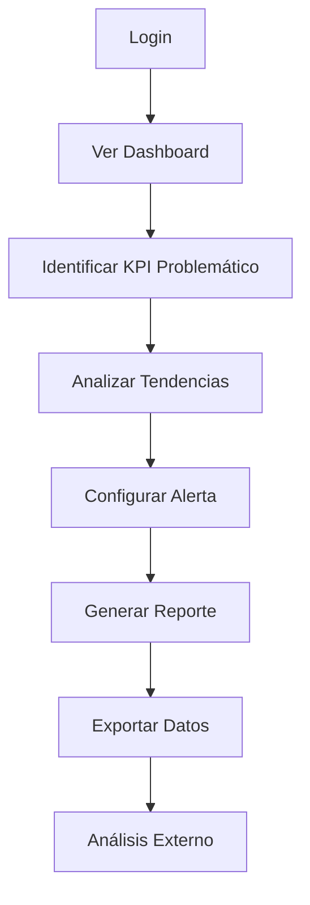
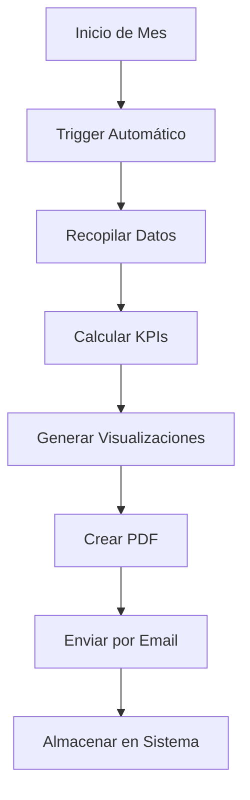
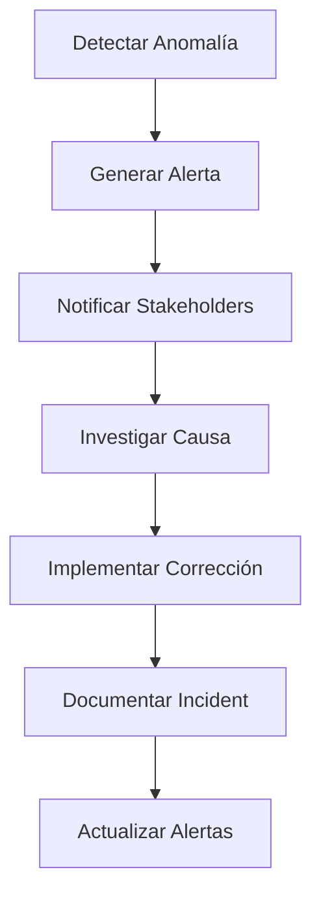

# Casos de Uso - Dashboard BMC

## 👥 Actores del Sistema

### Actores Principales
```
├── 👤 Usuario Final
│   ├── 📊 Analista Financiero
│   ├── 💼 Director Financiero (CFO)
│   ├── 🏢 Gerente de Operaciones
│   └── 👁️ Usuario Viewer (Solo lectura)
│
├── 👨‍💼 Administrador
│   ├── 🔧 Administrador del Sistema
│   └── 🔐 Administrador de Seguridad
│
└── 🤖 Sistema Externo
    ├── 💾 Sistema ERP
    ├── 🏦 API Bancaria
    └── 📈 Servicio de Datos Financieros
```

## 📋 Casos de Uso Principales

### 1. Autenticación y Acceso

#### CU-001: Iniciar Sesión
**Actor**: Usuario Final  
**Objetivo**: Acceder al sistema de dashboard  
**Precondición**: Usuario tiene credenciales válidas

**Flujo Principal:**
1. Usuario accede a la página de login
2. Usuario ingresa email y contraseña
3. Sistema valida credenciales
4. Sistema solicita código MFA (si está habilitado)
5. Usuario ingresa código MFA
6. Sistema genera JWT token
7. Usuario es redirigido al dashboard principal

**Flujos Alternativos:**
- **3a.** Credenciales inválidas: Sistema muestra error
- **5a.** Código MFA inválido: Sistema solicita nuevo código
- **5b.** Código MFA expirado: Sistema genera nuevo código

**Postcondición**: Usuario autenticado con sesión activa

---

#### CU-002: Configurar MFA
**Actor**: Usuario Final  
**Objetivo**: Habilitar autenticación de dos factores

**Flujo Principal:**
1. Usuario navega a configuración de seguridad
2. Usuario selecciona "Habilitar MFA"
3. Sistema genera QR code para TOTP
4. Usuario escanea QR con app autenticadora
5. Usuario ingresa código de verificación
6. Sistema valida y habilita MFA
7. Sistema genera códigos de respaldo

**Postcondición**: MFA habilitado para el usuario

---

### 2. Visualización de Dashboard

#### CU-003: Ver Dashboard Principal
**Actor**: Analista Financiero  
**Objetivo**: Visualizar métricas financieras clave

**Flujo Principal:**
1. Usuario accede al dashboard principal
2. Sistema carga KPIs principales del período actual
3. Sistema muestra widgets de métricas configurados
4. Sistema carga gráficos de tendencias
5. Sistema muestra alertas activas
6. Usuario visualiza datos en tiempo real

**Flujos Alternativos:**
- **2a.** Datos no disponibles: Sistema muestra mensaje informativo
- **4a.** Gráficos no cargan: Sistema muestra placeholder

**Postcondición**: Dashboard visible con datos actualizados

---

#### CU-004: Personalizar Dashboard
**Actor**: Analista Financiero  
**Objetivo**: Configurar widgets y layout personal

**Flujo Principal:**
1. Usuario entra en modo de edición de dashboard
2. Usuario arrastra y reordena widgets
3. Usuario añade nuevos widgets desde biblioteca
4. Usuario configura parámetros de widgets
5. Usuario guarda configuración personalizada
6. Sistema actualiza layout del usuario

**Postcondición**: Dashboard personalizado según preferencias

---

### 3. Análisis de KPIs

#### CU-005: Analizar Tendencias de KPI
**Actor**: Analista Financiero  
**Objetivo**: Estudiar evolución temporal de métricas

**Flujo Principal:**
1. Usuario selecciona KPI específico
2. Usuario define período de análisis (7d, 30d, 90d, 1y)
3. Sistema carga datos históricos del KPI
4. Sistema genera gráfico de tendencias
5. Sistema calcula estadísticas (promedio, variación)
6. Usuario interpreta tendencias y patrones

**Flujos Alternativos:**
- **3a.** Datos insuficientes: Sistema sugiere período alternativo
- **4a.** Error en cálculo: Sistema muestra mensaje de error

**Postcondición**: Análisis de tendencias disponible para revisión

---

#### CU-006: Configurar Alertas de KPI
**Actor**: Gerente de Operaciones  
**Objetivo**: Establecer notificaciones automáticas

**Flujo Principal:**
1. Usuario accede a configuración de alertas
2. Usuario selecciona KPI para monitorear
3. Usuario define umbrales (warning, critical)
4. Usuario configura destinatarios de notificación
5. Usuario especifica frecuencia de verificación
6. Sistema activa monitoreo automático

**Postcondición**: Alert configurada y activa

---

### 4. Generación de Reportes

#### CU-007: Generar Reporte Estándar
**Actor**: Director Financiero  
**Objetivo**: Crear reporte ejecutivo mensual

**Flujo Principal:**
1. Usuario navega a sección de reportes
2. Usuario selecciona template "Reporte Ejecutivo"
3. Usuario especifica período (mes anterior)
4. Usuario selecciona KPIs a incluir
5. Sistema genera reporte en PDF
6. Sistema envía reporte por email
7. Usuario descarga reporte generado

**Flujos Alternativos:**
- **5a.** Error en generación: Sistema reintenta automáticamente
- **6a.** Falla envío email: Sistema notifica al usuario

**Postcondición**: Reporte generado y disponible

---

#### CU-008: Programar Reporte Recurrente
**Actor**: Director Financiero  
**Objetivo**: Automatizar generación mensual de reportes

**Flujo Principal:**
1. Usuario accede a programación de reportes
2. Usuario selecciona template de reporte
3. Usuario define frecuencia (mensual, primer día hábil)
4. Usuario especifica destinatarios
5. Usuario configura parámetros del reporte
6. Sistema programa tarea recurrente
7. Sistema confirma programación exitosa

**Postcondición**: Reporte programado para generación automática

---

### 5. Exportación de Datos

#### CU-009: Exportar Datos de KPI
**Actor**: Analista Financiero  
**Objetivo**: Obtener datos para análisis externo

**Flujo Principal:**
1. Usuario selecciona KPIs para exportar
2. Usuario especifica rango de fechas
3. Usuario elige formato de exportación (CSV, Excel)
4. Sistema valida permisos de exportación
5. Sistema genera archivo de exportación
6. Usuario descarga archivo generado

**Flujos Alternativos:**
- **4a.** Sin permisos: Sistema muestra mensaje de error
- **5a.** Datos muy grandes: Sistema ofrece exportación por partes

**Postcondición**: Datos exportados exitosamente

---

### 6. Administración del Sistema

#### CU-010: Gestionar Usuarios
**Actor**: Administrador del Sistema  
**Objetivo**: Administrar cuentas de usuario

**Flujo Principal:**
1. Administrador accede a panel de usuarios
2. Administrador visualiza lista de usuarios
3. Administrador selecciona usuario a modificar
4. Administrador actualiza información o permisos
5. Sistema valida cambios
6. Sistema guarda modificaciones
7. Sistema envía notificación al usuario (si aplica)

**Flujos Alternativos:**
- **5a.** Validación falla: Sistema muestra errores específicos
- **7a.** Falla notificación: Sistema registra error en logs

**Postcondición**: Usuario actualizado en el sistema

---

#### CU-011: Monitorear Sistema
**Actor**: Administrador del Sistema  
**Objetivo**: Supervisar salud del sistema

**Flujo Principal:**
1. Administrador accede a dashboard de monitoreo
2. Sistema muestra métricas de performance
3. Sistema muestra estado de servicios
4. Administrador revisa alertas activas
5. Administrador toma acciones correctivas si necesario

**Postcondición**: Estado del sistema evaluado

---

### 7. Casos de Uso de Seguridad

#### CU-012: Auditar Acceso a Datos
**Actor**: Administrador de Seguridad  
**Objetivo**: Revisar accesos a información sensible

**Flujo Principal:**
1. Administrador accede a logs de auditoría
2. Administrador filtra por usuario/fecha/acción
3. Sistema muestra trail de auditoría
4. Administrador analiza actividad sospechosa
5. Administrador genera reporte de auditoría

**Postcondición**: Auditoría completada y documentada

---

#### CU-013: Responder a Incidente de Seguridad
**Actor**: Administrador de Seguridad  
**Objetivo**: Manejar evento de seguridad detectado

**Flujo Principal:**
1. Sistema detecta actividad sospechosa
2. Sistema genera alerta de seguridad
3. Administrador recibe notificación inmediata
4. Administrador investiga el incidente
5. Administrador toma medidas preventivas
6. Administrador documenta incidente
7. Sistema aplica medidas de mitigación

**Postcondición**: Incidente contenido y documentado

---

## 🎯 Casos de Uso por Prioridad

### Prioridad Alta (MVP)
```
✅ CU-001: Iniciar Sesión
✅ CU-003: Ver Dashboard Principal  
✅ CU-005: Analizar Tendencias de KPI
✅ CU-007: Generar Reporte Estándar
✅ CU-009: Exportar Datos de KPI
```

### Prioridad Media 
```
🔄 CU-002: Configurar MFA
🔄 CU-004: Personalizar Dashboard
🔄 CU-006: Configurar Alertas de KPI
🔄 CU-010: Gestionar Usuarios
🔄 CU-011: Monitorear Sistema
```

### Prioridad Baja
```
⏳ CU-008: Programar Reporte Recurrente
⏳ CU-012: Auditar Acceso a Datos
⏳ CU-013: Responder a Incidente de Seguridad
```

## 📊 Matriz de Casos de Uso vs Actores

| Caso de Uso | Analyst | CFO | Manager | Viewer | Admin | Security |
|-------------|---------|-----|---------|--------|-------|----------|
| CU-001      | ✅      | ✅  | ✅      | ✅     | ✅    | ✅       |
| CU-002      | ✅      | ✅  | ✅      | ✅     | ✅    | ✅       |
| CU-003      | ✅      | ✅  | ✅      | ✅     | ✅    | ❌       |
| CU-004      | ✅      | ✅  | ✅      | ❌     | ✅    | ❌       |
| CU-005      | ✅      | ✅  | ✅      | ✅     | ✅    | ❌       |
| CU-006      | ✅      | ✅  | ✅      | ❌     | ✅    | ❌       |
| CU-007      | ✅      | ✅  | ✅      | ❌     | ✅    | ❌       |
| CU-008      | ❌      | ✅  | ✅      | ❌     | ✅    | ❌       |
| CU-009      | ✅      | ✅  | ✅      | ❌     | ✅    | ❌       |
| CU-010      | ❌      | ❌  | ❌      | ❌     | ✅    | ❌       |
| CU-011      | ❌      | ❌  | ❌      | ❌     | ✅    | ✅       |
| CU-012      | ❌      | ❌  | ❌      | ❌     | ❌    | ✅       |
| CU-013      | ❌      | ❌  | ❌      | ❌     | ❌    | ✅       |

## 🔄 Flujos de Trabajo Complejos

### Workflow 1: Análisis Financiero Completo


### Workflow 2: Reporte Ejecutivo Mensual


### Workflow 3: Incident Response


## 🧪 Casos de Prueba

### Test Case TC-001: Login Exitoso
```
Precondición: Usuario registrado en sistema
Pasos:
1. Abrir página de login
2. Ingresar email válido
3. Ingresar contraseña válida  
4. Click en "Iniciar Sesión"

Resultado Esperado: 
- Usuario autenticado
- Redirección a dashboard
- Token JWT generado
```

### Test Case TC-002: Dashboard Load Performance
```
Precondición: Usuario autenticado
Pasos:
1. Navegar a dashboard principal
2. Medir tiempo de carga
3. Verificar carga de widgets
4. Verificar carga de gráficos

Resultado Esperado:
- Dashboard carga en < 3 segundos
- Todos los widgets visible
- Gráficos renderizados correctamente
```

### Test Case TC-003: Reporte Generation
```
Precondición: Usuario con permisos de reporte
Pasos:
1. Navegar a sección reportes
2. Seleccionar template
3. Configurar parámetros
4. Iniciar generación
5. Verificar descarga

Resultado Esperado:
- Reporte generado exitosamente
- PDF descargable
- Contenido correcto y completo
```

## 📋 Criterios de Aceptación

### Para cada Caso de Uso:

#### Funcionales
- ✅ **Flujo principal** completado sin errores
- ✅ **Flujos alternativos** manejados apropiadamente  
- ✅ **Validaciones** de entrada implementadas
- ✅ **Mensajes de error** claros y útiles
- ✅ **Performance** dentro de métricas establecidas

#### No Funcionales
- ✅ **Seguridad**: Autenticación y autorización verificadas
- ✅ **Usabilidad**: Interface intuitiva y responsive
- ✅ **Compatibilidad**: Funciona en navegadores soportados
- ✅ **Accesibilidad**: Cumple estándares WCAG 2.1 AA
- ✅ **Auditoría**: Todas las acciones logged apropiadamente

## 🎯 Métricas de Éxito

### Métricas de Usuario
- **Task Success Rate**: > 95%
- **Task Completion Time**: Dentro de benchmarks establecidos
- **Error Rate**: < 2%
- **User Satisfaction**: > 4.5/5

### Métricas Técnicas  
- **System Availability**: > 99.9%
- **Response Time**: < 2 segundos promedio
- **Error Rate**: < 0.1%
- **Security Incidents**: 0 críticos

---

*Casos de uso completos y listos para implementación - Dashboard BMC*